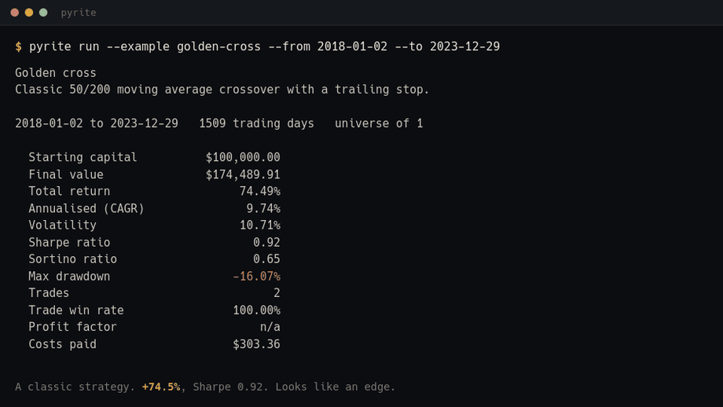
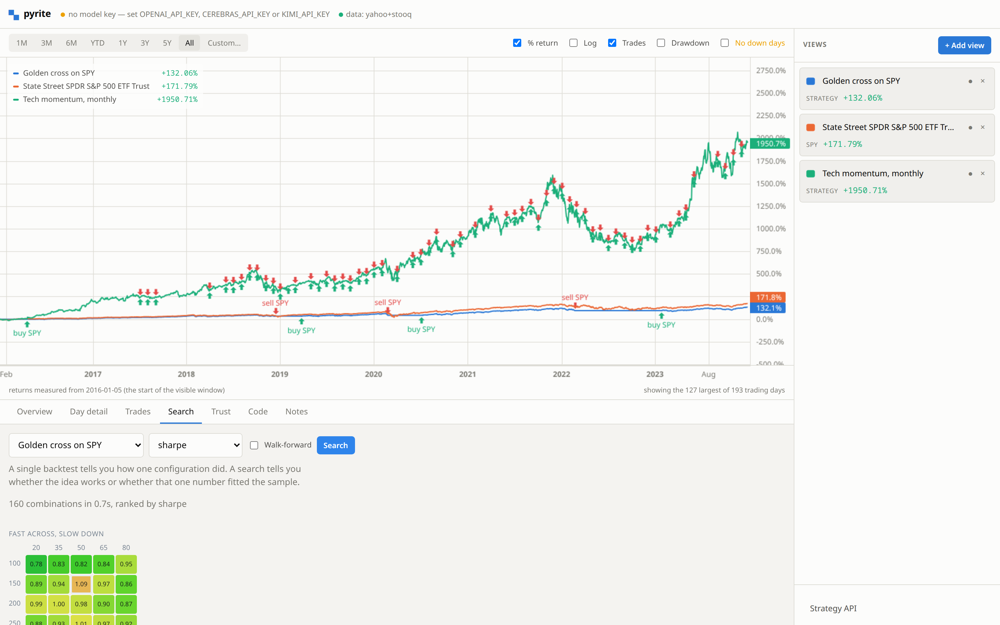
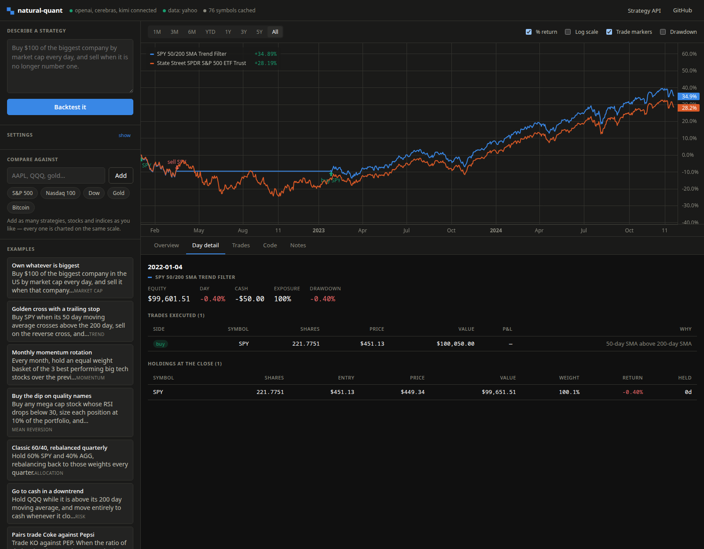
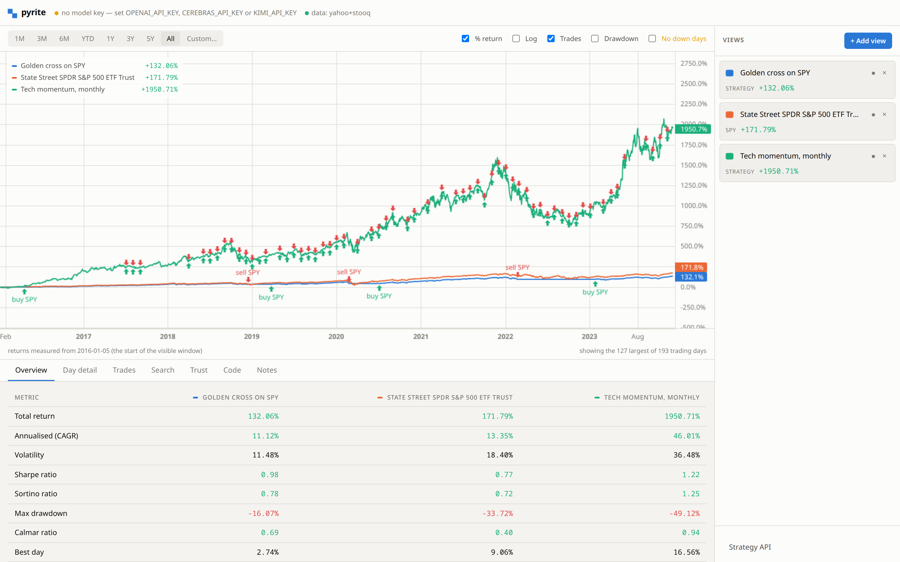
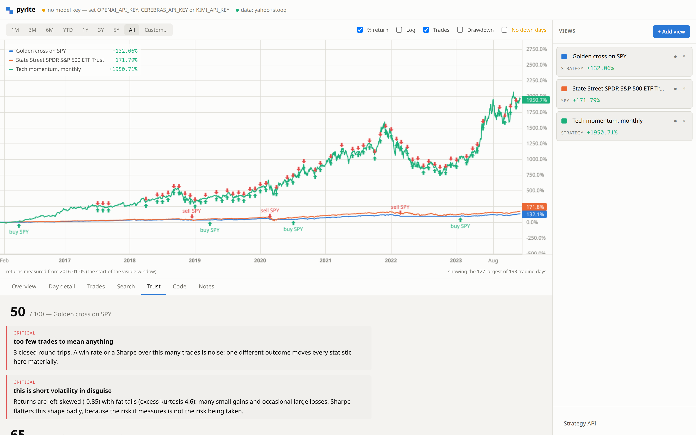

<div align="center">

<h1>pyrite</h1>

**Most backtests are fool's gold. This one tells you which.**

A backtester that spends as much effort trying to disprove your strategy as it
does running it. Describe an idea in plain English, and get back an equity
curve *and* the specific reasons not to believe it.

[](https://github.com/charbelkassab/pyrite/actions/workflows/ci.yml)
[](https://pkg.go.dev/github.com/charbelkassab/pyrite)
[](LICENSE)

[**Try it**](#try-it-in-30-seconds) ·
[Why](#why-this-exists) ·
[Install](#install) ·
[Tour](#a-tour-in-four-commands) ·
[What it measures](#what-it-measures) ·
[Honest data](#the-data-is-the-hard-part) ·
[Python](#from-python) ·
[Limitations](#what-it-cannot-tell-you)

<br>



</div>

---

## Try it in 30 seconds

No API key. No account. No config file. No network, if you like.

```bash
go install github.com/charbelkassab/pyrite/cmd/pyrite@latest

pyrite run --example golden-cross --from 2018-01-02 --to 2023-12-29
```

*(The date range is fixed so this output stays reproducible. Without it the
backtest runs the full available history, up to today. Your figures may differ
in the last decimal place or two: vendors revise adjusted closes whenever a
dividend or split is applied, so a 2018 price is not quite the same number this
year as it was last. The engine itself is deterministic — the same data always
gives the same result.)*

```
Golden cross
Classic 50/200 moving average crossover with a trailing stop.

2018-01-02 to 2023-12-29   1509 trading days   universe of 1

  Starting capital          $100,000.00
  Final value               $174,489.91
  Total return                   74.49%
  Annualised (CAGR)               9.74%
  Volatility                     10.71%
  Sharpe ratio                     0.92
  Sortino ratio                    0.65
  Max drawdown                  -16.07%
  Trades                              2
  Trade win rate                100.00%
  Costs paid                    $303.36

  ... round trips, attribution and rolling statistics ...

How much should you believe this?  50/100

  STOP too few trades to mean anything
        2 closed round trips. A win rate or a Sharpe over this many trades
        is noise: one different outcome moves every statistic here
        materially.

  STOP this is short volatility in disguise
        Returns are left-skewed (-0.74) with fat tails (excess kurtosis
        5.0): many small gains and occasional large losses. Sharpe flatters
        this shape badly, because the risk it measures is not the risk being
        taken.

  Comparison               Total return   Max drawdown
  Golden cross                   74.49%        -16.07%
  State Street SPDR S&P…         95.54%        -33.72%
```

**That last section is the product.** The equity curve is table stakes.

```bash
pyrite examples                  # eight bundled strategies, all runnable
pyrite serve --offline --open    # the web app, on synthetic data
pyrite doctor                    # what works right now, and how to fix the rest
```

---

## Why this exists

Backtesting is the easiest way in finance to fool yourself, and most tools make
it easier rather than harder.

Search enough parameters and something looks excellent by chance. Pick from
today's index and you have quietly excluded every company that failed. Charge
no commission and a strategy that trades daily looks free. Size a position
without modelling impact and it scales to infinity. None of this shows up in
the equity curve — which is the one thing every backtester puts on screen.

pyrite computes the things that would tell you, and says so on every run
without being asked.

| It measures | So you find out |
| --- | --- |
| **Deflated Sharpe** | whether the Sharpe survives the number of strategies you tried to find it |
| **Probability of backtest overfitting** | how often the in-sample winner lands below median out of sample |
| **Reality check and SPA** | whether the best of everything you tried beats doing nothing, allowing for how much you tried |
| **Null strategy distribution** | whether it beats trading at random with the same trade count, holding periods and exposure |
| **Walk-forward efficiency** | how much of the improvement survives on data the search never saw |
| **Plateau ratio** | whether the winner sits on a ridge or is a lone spike |
| **Cost sensitivity** | the slippage at which the edge disappears |
| **Block bootstrap** | the drawdown to plan around, not the one that happened |
| **Market impact** | what your size costs, under the square-root law |
| **Point-in-time membership** | what the index actually held that day, failures included |
| **Point-in-time news** | what had actually been published by then, not what the web says now |

It is a single Go binary. No accounts, no signup, no telemetry, no cloud
service, no database. It runs on your laptop and writes to `~/.pyrite`.

---

## Install

**Prebuilt binary** — [releases](https://github.com/charbelkassab/pyrite/releases),
for Linux, macOS and Windows. Verify against `SHA256SUMS`.

**Go** (needs [Go 1.25+](https://go.dev/dl/)):

```bash
go install github.com/charbelkassab/pyrite/cmd/pyrite@latest
```

**Docker** — a 29 MB image, non-root, no external services:

```bash
docker run --rm -p 8080:8080 ghcr.io/charbelkassab/pyrite \
  serve --addr 0.0.0.0:8080 --offline
# or: docker compose up
```

**From source**:

```bash
git clone https://github.com/charbelkassab/pyrite && cd pyrite
make build && ./pyrite run --example golden-cross
```

### Turning on plain English

Everything above works with no model. Turning a *sentence* into a strategy
needs one, and there are two ways to have one:

```bash
# Free, on your machine. pyrite finds it automatically on startup.
ollama pull qwen2.5-coder:7b

# Or hosted, for better output.
export OPENAI_API_KEY=sk-...     # or CEREBRAS_API_KEY, or KIMI_API_KEY
```

Then:

```bash
pyrite run "buy $100 of the biggest company by market cap every day,
            and sell when that company is no longer number one"
```

`pyrite doctor` reports which of these it can see, and what to do if the answer
is none.

---

## A tour in four commands

The same strategy, looked at four ways. Each one is harder to fool than the
last, and the story they tell together is the point of the tool.

<br>

### 1. `run` — one backtest, and what is wrong with it

Everything in [Try it](#try-it-in-30-seconds) above. A curve, the trade-level
detail behind it, and a critique that reads the result and names the problems.

Add `--cost-scan` to re-run at 0, 5, 20 and 50 bps of slippage. On a
high-turnover strategy the difference is not subtle — here is a daily reversal
that looks like one of the best strategies you have ever seen, until it has to
pay to trade:

```
$ pyrite run --example daily-reversal --from 2018-01-02 --to 2023-12-29 --cost-scan

How much survives friction?
  Slippage             Return         CAGR       Sharpe      Costs
  0 bps               328.50%       27.51%         0.86      $0.00
  5 bps                16.28%        2.55%         0.25 $209,053.60
  20 bps              -97.69%      -46.71%        -1.57 $172,515.27
  50 bps             -100.00%      -85.64%        -5.22 $115,339.09

  Break-even slippage                   7.1 bps

  the edge breaks even at around 7.1 bps of slippage. That is inside the
  range a real account would pay on anything but the most liquid names
```

**+328% gross, −97.7% at 20 bps.** The strategy replaces its whole book every
session, so the entire result was the spread it never paid. A backtester that
defaults slippage to zero shows you the first row and stops.

`--capacity` asks the other half of that question. A backtest on $100,000 says
nothing about whether the idea survives at size, so the ladder re-runs it at
five account sizes with the square-root impact model on, and friction is shown
per dollar traded because that is the only column size can move:

```
$ pyrite run --example daily-reversal --from 2018-01-02 --to 2023-12-29 --capacity

How much money can this take?
  Capital              Return         CAGR       Sharpe   Friction
  $100k               -15.10%       -2.70%         0.10      6 bps
  $1.0m               -50.87%      -11.19%        -0.15      8 bps
  $10.0m              -84.09%      -26.44%        -0.68     13 bps
  $100.0m             -97.15%      -44.82%        -1.48     25 bps
  $1.0bn              -99.64%      -61.00%        -2.42     58 bps
```

Where a strategy is still profitable at the bottom of the ladder, the tool
interpolates the size the edge dies at and says it is an estimate off five
rungs. Where impact never reaches it — `golden-cross` gives up 1.9 points of
return between $100k and $1bn — it says that instead of inventing a threshold.

`--decay` is the same scepticism pointed at the holding period: the average
round trip's cumulative return 1 to 40 bars after entry, where it peaks, and
whether it is still rising when the position is closed. A curve that peaks on
day 3 against a 40-day hold means the entries are finding something and the
exit is giving it back.

<br>

### 2. `sweep` — the whole parameter space, not one point

A single backtest tells you how one configuration did over one sample. It
cannot tell you whether the idea works or whether that number happened to fit.

```bash
pyrite sweep --example golden-cross --from 2015-01-05 --to 2023-12-29
```

```
160 combinations in 995ms, ranked by sharpe

                                  sharpe     return   drawdown     trades    win%
  fast=50 slow=150 trail=0.12       0.89    128.85%    -15.99%          6  83.33%
  fast=50 slow=150 trail=0.14       0.88    127.44%    -14.61%          6  83.33%
  fast=80 slow=250 trail=0.12       0.87    115.32%    -16.96%          3 100.00%
  ... and 157 more

fast across, slow down, shaded by sharpe

  250 │  +  +  %  *  %
  200 │  #  %  #  +  #
  150 │  =  +  @  +  *
  100 │     :  .  -  +
      └───────────────
        20 35 50 65 80

       0.569 .   worst   :-=+*#%   best   0.888 @
       A broad warm region is an edge. One bright cell in a dark
       field is a fluke, however good its number looks.

How much of this is real?
  Best sharpe                             0.888
  Median sharpe                           0.652
  Expected best from luck alone           0.426
  Combinations above zero               100.00%
  Neighbour support                      82.51%
  Prob. of backtest overfitting          81.43%   (70 splits)
  Deflated Sharpe                        91.09%

  best sharpe 0.89 against 0.43 expected from luck alone over 160 trials;
  the winner sits on a broad plateau (neighbours average 83% of its score),
  which is what a real edge looks like; probability of backtest overfitting
  is 81% — selecting on this sample carries no information about the next
  one
```

A heatmap is the fastest overfitting detector ever built — one bright cell in a
dark field is a fluke, a broad warm region is an edge, and the eye reads that
instantly. The statistics put numbers on it:

- **Expected best from luck alone** — what the top of *N* trials scores with no
  skill at all, given the spread the search actually produced. A best below
  that line is not evidence of anything.
- **Deflated Sharpe** — corrected for the number of trials, plus the skew and
  fat tails of the winner's own returns.
- **Probability of backtest overfitting** — across many train/test splits of
  the same period, how often the in-sample winner lands below median out of
  sample. 50% is a coin flip.
- **Neighbour support** — how the cells beside the winner scored.
- **Reality check and SPA p-values** — White's and Hansen's tests, run over
  every trial's return series at once rather than the winner's alone. The null
  is that the best of them has no positive expected performance; the benchmark
  it is stated against is holding cash, which is a low bar for anything long
  the market.
- **Beats random entries** — the winner against a thousand random strategies
  matched to it on trade count, on holding periods and on exposure. A strategy
  that cannot beat matched random trading has no edge, whatever its Sharpe is.



<br>

### 3. `walkforward` — choose on one period, report on the next

The sweep above returned a split verdict: the winner sits on a *broad plateau*,
"what a real edge looks like", but an 81% probability of overfitting says
choosing on that sample tells you nothing about the next one. Those two claims
cannot both be right. Here is the tiebreak — the plateau meeting data it was
not chosen on.

```bash
pyrite walkforward --example golden-cross --from 2010-01-05 --to 2023-12-29 \
    --train 500 --test 150
```

```
Stitched out-of-sample equity — the only curve here that was never fitted to
  Total return                           -3.94%
  Annualised (CAGR)                      -0.34%
  Sharpe ratio                            -0.06
  Max drawdown                          -10.65%
  Ulcer index                             5.05%

  Mean in-sample return                  21.86%
  Mean out-of-sample return              -0.17%
  Walk-forward efficiency                -0.78%
  Positive test windows                    3 / 20
  Parameter stability                    26.32%

  3 of 20 test windows finished positive; out-of-sample returns are negative
  against positive in-sample ones (efficiency -0.8%), which is the signature
  of a fitted strategy; the winning configuration changed in 74% of
  re-optimisations, so the strategy does not have a stable optimum
```

**+21.9% in sample, −0.2% out of it, and 3 of 20 windows positive.** The
plateau was real and it did not transfer; the overfitting statistic was right
and the shape of the surface was misleading. That gap is the single most useful
number in this document, and no amount of staring at an equity curve produces
it.

Parameters are chosen on each training window and applied unchanged to the
window that follows, with an embargo between them so a 200-day indicator cannot
leak across the boundary.

<br>

### 4. `improve` — "make this better", without the usual trap

```bash
pyrite improve "a golden cross on SPY" --budget 8
```

A model proposes a variant, the harness backtests it, the model reads the
result and proposes again. Under a fixed budget it converges on something
better than it started with — and that loop is also an excellent way to build a
strategy that fits one sample perfectly and has no edge whatever.

So the harness, not the model, owns the data:

- The period is split. The model sees results from the **training window
  only**, and every candidate runs over that window alone.
- The `Candidate` type it receives **has no out-of-sample field**. It cannot
  read what the struct does not hold.
- The holdout is touched **once**, at the end, after the search has closed, to
  score the winner that training data already chose.

```
Searched 2018-01-02 to 2022-03-04. Held back 2022-03-07 to 2023-12-29.
The holdout was not visible during the search and was scored once, at the end.

  #      return       CAGR   drawdown   trust  what changed
  1     ...            ...        ...     ...  baseline
  2     ...            ...        ...     ...  widened the exit band
* 3     ...            ...        ...     ...  added a regime filter
  ...

The winner, on data the search never saw
                                training        holdout
  Total return                        ...            ...
  Annualised (CAGR)                   ...            ...
  Sharpe ratio                        ...            ...
  Max drawdown                        ...            ...
  Surviving fraction                             ...
```

Both columns are always shown together, and **surviving fraction** — how much
of the training result the holdout kept — is the number to read first. This is
the one command here that needs a model, so the figures depend on which one you
point it at; every other output on this page was produced by running the
command shown above it.

The model is handed the *critique* of each attempt rather than raw numbers, so
it can act on a stated fault — "only 12 closed trades", "short volatility in
disguise" — instead of guessing. It is told that chasing the last of the
training performance is actively harmful, and that stopping early is a
legitimate answer.

<br>

### And `report` — all of it, as one document

```bash
pyrite report "a golden cross on SPY" --out report.md --html report.html
```

Runs the backtest, the parameter search, the walk-forward, the cost scan and a
block bootstrap, then writes one Markdown document: **verdict first**, then the
results against the benchmark, the out-of-sample evidence, the robustness
statistics, where the return came from, what survives friction, the
distribution of outcomes the same process could have produced, the specific
objections, the provenance, and the code.

Every number in it is computed. With a model key the document also opens with a
written summary; without one it is still complete, because prose is the only
part a model contributes.

`--html` writes the same document as one self-contained page: the equity curve,
the drawdown beneath it and the calendar years drawn as inline SVG, light and
dark, no scripts and no network requests of any kind. It opens from a `file://`
URL, prints to a sensible PDF, and is the version to send somebody. The two
flags work together or on their own.

---

## What it measures

<details>
<summary><strong>Performance and risk</strong> — around 45 statistics</summary>

<br>

Total return, CAGR, volatility, Sharpe, Sortino, Calmar, maximum drawdown with
its dates, longest drawdown, best and worst day, win rate.

Omega, ulcer index, Martin ratio, VaR and CVaR at 95% and 99%, skew, excess
kurtosis, tail ratio, gain-to-pain, Kelly fraction, R² of the log equity curve,
up and down capture, alpha, beta, tracking error, information ratio.

Rolling Sharpe, volatility and beta as series, because one Sharpe for ten years
hides that it was 2.4 for three of them.

</details>

<details>
<summary><strong>Trades</strong> — round trips, not fills</summary>

<br>

Fills are paired FIFO into entry-and-exit round trips, which is the only level
at which "did this idea work" is a meaningful question.

Each carries **maximum adverse and favourable excursion** — the worst and best
the position ever looked while it was open, measured intrabar. These are the
two numbers no equity curve can show you. A losing trade with a large MFE was
right and then gave it back: the exit is the problem, not the entry. A winning
trade with a large MAE was paid for surviving noise, and a tighter stop would
have destroyed it.

Plus expectancy, payoff ratio, holding-period distribution, consecutive
win/loss runs, an edge ratio, and a give-back figure.

</details>

<details>
<summary><strong>Attribution</strong> — where the return actually came from</summary>

<br>

By calendar year, by month, by month-of-year, by market regime (calm, normal,
high volatility, bear — classified off the benchmark), and by holding.

Two stress tests, because most backtests are one or two good stretches wearing
a trench coat: what the result looks like with the best month removed, and with
the best five days removed.

</details>

<details>
<summary><strong>The searching itself</strong> — trials counted across sessions, not just within one</summary>

<br>

The deflated Sharpe and the probability of backtest overfitting both correct
for how many combinations *one* search tried. Run forty sweeps over the same
symbols and the same period across three weeks and you have performed thousands
of trials, and every one of those statistics quietly assumed you started that
morning.

The ledger remembers. Every run and sweep is recorded against a dataset key —
sorted symbols or index name, start, end, bar size — so the count follows the
research problem rather than the session:

```
$ pyrite ledger

  dataset                                    trials  sessions     best     luck  first      last
  SPY:2019-01-02:2023-12-29:1d                  229         7     0.79     0.62  2026-08-31 2026-08-31
```

A run or sweep that is no longer the first says so:

```
you have now tried 229 configurations against this dataset across 7 sessions;
a Sharpe below 0.62 is what the best of 229 tries reaches by luck alone
```

`pyrite ledger --dataset <key>` for one problem in full, `--reset` to start its
count again, `PYRITE_NO_LEDGER=1` to keep no history at all.

</details>

<details>
<summary><strong>Portfolio construction</strong> — beyond equal weight</summary>

<br>

`ctx.optimize(symbols, { objective: "hrp" })` returns weights ready for
`ctx.rebalance()`: minimum variance, maximum Sharpe, risk parity, hierarchical
risk parity, inverse volatility, and equal weight as the baseline the rest have
to beat.

Ledoit–Wolf shrinkage is on by default and chosen from the data. A covariance
matrix estimated from 252 days across 30 assets is mostly noise, and
minimum-variance and maximum-Sharpe both invert it — amplifying exactly that
noise into confident, wrong weights.

Pure Go. No linear algebra dependency, because the single-binary property is
worth more than the few hundred lines it saves.

</details>

<details>
<summary><strong>Indicators</strong> — around 35 built in</summary>

<br>

Moving averages (SMA, EMA, WMA, HMA), RSI, MACD, Bollinger, ATR, Keltner,
Donchian, ADX with its directional components, Stochastic, Williams %R, CCI,
OBV, MFI, VWAP, CMF, SuperTrend, Aroon, PSAR, Ichimoku, TRIX, ROC, Choppiness,
z-score, correlation, beta, a linear-regression fit, and market-cap ranking.

Every indicator a model has to hand-roll is a fresh chance to seed an EMA from
the wrong bar or smooth a Wilder average as a simple one — and the output is
still a plausible number, so nothing catches it.

</details>

---

## The data is the hard part

Everything above is engineering. This is where a backtester is usually dishonest
without meaning to be.

**Survivorship bias is fixed for the S&P 500.** `--universe sp500` resolves per
simulated day from recorded index membership — 881 tenures across 502 current
and 379 former constituents. A 2022 backtest can pick Silicon Valley Bank and
take the loss it really produced; it cannot pick Tesla before it joined in
December 2020. Rebuild the table yourself with `pyrite ingest index`.

**Market caps come from filings.** Ranking by market cap needs shares
outstanding *as of the historical date*. The SEC's XBRL company-facts API
serves the full disclosure history per company, free and keyless, so the
bundled table is generated from real filings — 8,473 rows across 290 symbols,
each citing its accession number. Rows are dated by when the filing was
**published**, not when the count was measured: a share count on a 31 March
cover page was not knowable until the 10-Q appeared in May.

**News is point-in-time.** `ctx.news()` queries an article index with an
explicit publication-date window ending at the simulated day, so a strategy
standing on 4 March 2019 sees what had been published by 4 March 2019 and
nothing after it. It never falls back to a live feed when the index is empty —
silently substituting today's internet would reintroduce exactly the bias this
removes, and do it invisibly.

**Economic series carry their release lag.** `ctx.fred("T10Y2Y")` reads St.
Louis Fed data as of the simulated day. US CPI for March is stamped 1 March and
not published until mid-April, so reading it on the 3rd is trading on a number
nobody had. Each series is queried at *today minus its publication delay*.

**Bar sizes from one minute to one month.** Every annualised statistic scales
with the bar size — a Sharpe computed on 1-minute bars and annualised as daily
would be out by about twentyfold, flatteringly. A strategy can read a coarser
timeframe from inside a finer run, so a daily trend filter with 5-minute
entries is a few lines.

**Providers fall through per symbol.** Free endpoints fail for individual
names rather than globally, and dropping those names from a forty-symbol
universe silently changes the backtest — so the next vendor is tried for
exactly the symbols that failed. Point `PYRITE_CSV_DIR` at your own data to use
a paid vendor, or to backtest delisted securities.

---

## The strategy API

A strategy is two functions. The model writes against the same document you
can read (`pyrite api`).

```js
// This is examples/golden-cross.js — the strategy every number above came from.

function setup(ctx) {
  ctx.universe(["SPY"]);

  // Every number this strategy depends on is declared rather than written
  // inline, so `pyrite sweep` can search the space around it instead of
  // testing the one point someone happened to pick.
  ctx.param("fast", 50, { grid: [20, 35, 50, 65, 80] });
  ctx.param("slow", 200, { grid: [100, 150, 200, 250] });
  ctx.param("trail", 0.12, { min: 0.06, max: 0.20, step: 0.02 });

  // Warm-up comes from the largest value the slow grid can take, not from
  // its default: 200 bars would leave the 250 setting untradeable.
  ctx.warmup(270);
}

function onDay(ctx) {
  const fast = ctx.sma("SPY", ctx.params.fast);
  const slow = ctx.sma("SPY", ctx.params.slow);
  if (fast === null || slow === null) return;   // indicators return null, always guard

  // Detect the *crossing*, not the condition. "fast > slow" is true on every
  // day of a trend; a crossover strategy should act only on the day it
  // becomes true.
  const above = fast > slow;
  const wasAbove = ctx.state.above;
  ctx.state.above = above;
  if (wasAbove === undefined) return;

  if (above && !wasAbove) {
    ctx.buy("SPY", { pctCash: 1, trailingStop: ctx.params.trail }, "50d crossed above 200d");
  } else if (!above && wasAbove && ctx.hasPosition("SPY")) {
    ctx.close("SPY", "50d crossed below 200d");
  }
}
```


Swap `ctx.universe(["SPY"])` for `ctx.universe("sp500")` and the same two
functions run against whatever the index actually held on each simulated day,
failures included.

**Every number is declared, not written inline.** A number written inline can
only ever be tested at the value it was written at. Declaring it is what lets
`sweep` search the space and `walkforward` choose on one period and report on
another.

`ctx` gives you prices and history, the indicators, market-cap ranking,
portfolio state, orders by shares / dollars / target weight, stop-loss,
take-profit and trailing stops, portfolio construction, economic series,
lifecycle hooks (`onFill`, `onStop`, `onWeek`, `onMonth`), multi-timeframe
access, persistent state, and the model and news hooks.

Generated code runs in [goja](https://github.com/dop251/goja), a pure-Go
interpreter with **no filesystem, network, process or timer access**. The only
capabilities a strategy has are the ones attached to `ctx`, and each is
counted, capped and recorded.

Full reference: [`internal/strategy/assets/api.md`](internal/strategy/assets/api.md).

---

## Orders fill at the next open

This is the default and it is the single most important decision in the engine.

Filling at a close the strategy has already observed is lookahead bias, and it
silently inflates returns. You can switch to close fills for comparison with
published backtests that do it, and the interface labels that choice
optimistic.

**Modelled:** commissions, slippage (5 bps by default, not zero), short borrow,
splits and dividends, cash drag, next-open fills, and — with `--impact 1` —
market impact under the square-root law, so a large order pays for the
liquidity it demands. That last one changes results more than anything else
here: the daily reversal above returns **−15.1% on $100,000 and −99.6% on
$1bn**, purely because the second has to move the market to get filled.

```bash
pyrite run --example daily-reversal --from 2018-01-02 --to 2023-12-29 \
    --impact 1 --cash 1000000000
```

---

## The web app

```bash
pyrite serve --open
```

Everything on the chart is a **view** — a strategy, or any ticker, index or ETF
— normalised to percentage return so a $100,000 portfolio and a $300 share
price are honestly comparable. Returns rebase to what you are looking at: zoom
to 1Y and every series restarts at zero from the first visible bar, because
measuring a zoomed view against a baseline scrolled off the left edge is how
comparison charts mislead people.

Click any day for the full audit trail of that session — what was bought and
sold and *why*, every open position with its weight and unrealised P&L, the
strategy's own log lines, and the exact prompt and reply if it consulted a
model.



The **Trust** tab lists what is wrong with each result. The **Search** tab runs
the parameter space and draws the surface.





Built on [Lightweight Charts](https://github.com/tradingview/lightweight-charts),
vendored locally so the app has zero external runtime dependencies. Vanilla
JavaScript, no build step.

---

## From Python

```bash
pip install pyrite-quant     # the distribution; `import pyrite` either way
```

```python
from pyrite import Client

with Client.serve(offline=True) as nq:          # starts and stops a server
    run = nq.backtest(code=strategy, universe=["SPY"], start="2015-01-01")

    run.curve.plot()
    print(run.trades[["symbol", "net_pnl", "mae_pct", "mfe_pct"]])
    print(run.by_year)

    for f in run.critique:
        print(f"[{f['severity']}] {f['title']}")

    sw = nq.sweep(code=strategy, universe=["SPY"])
    print(sw.surface("fast", "slow"))           # a grid, ready for a heatmap
    print(sw.robustness["pbo"])
```

A client, not a reimplementation — the Go binary does the work, so a notebook
and the CLI can never disagree about what a backtest means. Standard library
only; pandas is optional and upgrades tables to DataFrames when present. See
[`python/`](python/).

---

## From an agent

```bash
claude mcp add pyrite -- /usr/local/bin/pyrite mcp
```

`pyrite mcp` serves the [Model Context Protocol](https://modelcontextprotocol.io)
over stdio, so Claude can write a strategy, run it, read what is wrong with it
and revise. Five tools: `strategy_api`, `list_examples`, `backtest`, `sweep`,
`walkforward`.

The direction is the point. Everywhere else here a model is a component pyrite
calls; over MCP pyrite is the tool and the model is the caller, and an agent
left alone with a backtester will try variations until one looks good — the
exact failure the rest of this project exists to measure. So every result that
came from a backtest carries its critique, its trust score and its verdict in
the same payload as the numbers. There is no call that returns one without the
other.

For Claude Desktop, and the full tool reference, see [docs/mcp.md](docs/mcp.md).
No API key is needed: a key compiles English into a strategy, and an agent
writes the JavaScript itself.

---

## What it cannot tell you

A backtesting tool that oversells itself is worse than useless, so here is the
honest accounting. The full version is in
[docs/limitations.md](docs/limitations.md).

**Survivorship bias outside the S&P 500.** The other universes (`megacap`,
`tech`, `dow`, …) list companies that matter *today*. And even with
point-in-time membership, prices are the other half: free vendors do not serve
delisted securities, so a dropped name resolves to a data error rather than the
loss it produced, unless you supply its history.

**Intraday history is short.** Free intraday data reaches back about a month
for 1-minute bars and two months for 5- to 30-minute. That is far too short to
conclude anything.

**`ctx.web()` still has lookahead.** News is date-bounded; general web search is
not. And a model reading point-in-time headlines was itself trained on text
written afterwards, so it knows how the period ended — a milder bias, but a
real one, and the run says so.

**Not modelled:** taxes, prices and stops that trigger between bars, options,
futures roll, market impact unless you enable it, borrow availability, tick
data, the order book.

And the ordinary one: past performance says very little about future returns,
an overfitted backtest says nothing at all, and it is easy to produce one by
trying prompts until something looks good. The statistics in this tool exist to
put a number on how much of a result is that.

---

## Reference

<details>
<summary><strong>Command line</strong></summary>

<br>

```
pyrite serve [flags]              start the web app (default)
pyrite run "<strategy>"           one backtest, with its own critique
pyrite run --example NAME         run a bundled strategy, no key needed
pyrite examples                   list the bundled strategies
pyrite report "<strategy>"        the full battery, as one document
pyrite scenarios "<strategy>"     replay it through named historical crises
pyrite diff --example A --example B
                                  run two strategies over one setup and test
                                  whether the gap between them is noise

pyrite sweep "<strategy>"         every combination, plus a heatmap and
                                  the overfitting statistics
pyrite walkforward "<strategy>"   choose on one period, report on the next
pyrite improve "<strategy>"       guided search against a blind holdout
pyrite ledger                     how much searching each dataset has already
                                  absorbed, across every past session

pyrite ingest edgar               point-in-time share counts, from SEC filings
pyrite ingest index               point-in-time S&P 500 membership

pyrite mcp                        serve the Model Context Protocol on stdio

pyrite selftest                   run the critique against strategies built to
                                  be caught; exits 1 if a defect is missed
pyrite doctor                     what works right now, and how to fix the rest
pyrite api                        print the strategy API reference
pyrite cache clear [--ai]         clear cached market data and replies
pyrite version
```

Common flags: `--from`, `--to`, `--cash`, `--benchmark`, `--universe`,
`--interval`, `--impact`, `--code-file`, `--offline`, `--json`.

Per command: `run --cost-scan --capacity --decay` · `diff` takes two of
`--example`/`--code-file` in either combination, first is A · `sweep --param fast=10,20,50 --objective
sharpe --csv out.csv` · `walkforward --train 504 --test 126 --embargo 200
--anchored` · `improve --budget 6 --holdout 0.3 --goal "..."` · `report --out
report.md --html report.html` · `scenarios --list` · `ledger --dataset <key>
--reset --yes`.

A key is needed only to compile plain language. Every search above runs on
`--code-file` or `--example` with none.

</details>

<details>
<summary><strong>Configuration</strong></summary>

<br>

Everything has a sensible default. Override with environment variables or
`$PYRITE_DATA_DIR/config.json`.

| Variable | Default | Purpose |
| --- | --- | --- |
| `OPENAI_API_KEY` / `CEREBRAS_API_KEY` / `KIMI_API_KEY` | — | Hosted model access |
| `PYRITE_ADDR` | `127.0.0.1:8080` | Listen address |
| `PYRITE_DATA_DIR` | `~/.pyrite` | Caches and saved runs |
| `PYRITE_DATA_PROVIDERS` | `yahoo,stooq` | Ordered fallback chain |
| `PYRITE_CSV_DIR` | — | A directory of `SYMBOL.csv` files, tried first |
| `PYRITE_NEWS_PROVIDER` | `gdelt` | `gdelt` (point-in-time), `live`, or `none` |
| `PYRITE_ROUTE_QUALITY` / `_BALANCED` / `_FAST` | auto | Model tier routing |
| `PYRITE_<PROVIDER>_MODEL` | per provider | Model override |
| `PYRITE_MAX_AI_CALLS` | `2000` | Per-run budget for `ai()` and `web()` |
| `PYRITE_NO_LEDGER` | `false` | Stop counting trials across sessions |
| `PYRITE_OFFLINE` | `false` | Synthetic data, no network |

Ollama and LM Studio are detected automatically on their default ports.

</details>

<details>
<summary><strong>Development</strong></summary>

<br>

```bash
make check          # gofmt, vet and the full suite — no network, no API keys
make smoke          # what a new user does in their first five minutes
make test-python    # the Python client, against a real server
make dev            # serve with live front-end editing
make docker         # build the container image
```

The front end is embedded with `go:embed`, so a normal build bakes in `web/`.
`--dev ./web` serves it from disk while you work on it.

The project's real regression suite for the compiler is a corpus of
plain-English prompts that must compile *and* run. It costs API calls, so it is
opt-in:

```bash
PYRITE_LIVE_TESTS=1 go test ./internal/strategy/ -run TestPromptCorpus -v -timeout 60m
```

**If pyrite cannot handle a strategy you care about, adding it to
[`internal/strategy/testdata/corpus.json`](internal/strategy/testdata/corpus.json)
is the most useful thing you can do.** That corpus is how the API grows.

See [CONTRIBUTING.md](CONTRIBUTING.md).

</details>

---

## Licence

MIT for the code. See [LICENSE](LICENSE) and [NOTICE](NOTICE) for third-party
components — note that the bundled S&P 500 membership table is derived from
Wikipedia and carries CC BY-SA 4.0 separately from the code licence.

pyrite is a research and education tool. It is not investment advice, it is not
a broker, and it will not place a real order. Nothing here is a recommendation
to buy or sell anything.
